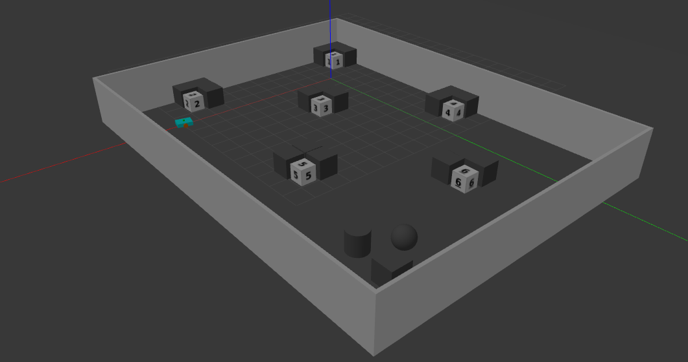

# 🏗️ gazebo_bringup



This ROS 2 package helps you **spawn any robot** into a **Gazebo simulation** environment with optional RViz visualization.

---

## 📦 Features

- Launches a gazebo simulation environment
- Spawns any robot in a given gazebo simulation environment
- Optional RViz GUI toggle
- Clean launch config using arguments


## 🛠️ Build Instructions

```bash
cd ~/ros2_ws/src
git clone https://github.com/manojm-dev/gazebo_bringup.git
cd ..
colcon build --packages-select gazebo_bringup
source install/setup.bash
```


## 📦 Installing Dependencies

```
cd ~/ros2_ws
sudo apt-get update -y && rosdep update && rosdep install --from-paths src --ignore-src -y
```

## 🛠️ Build Instructions

```bash
cd ~/ros2_ws/src
git clone https://github.com/manojm-dev/gazebo_bringup.git
cd ..
colcon build --packages-select gazebo_bringup
source install/setup.bash
```

## 🚀 Run the Simulation

```bash
ros2 launch gazebo_bringup simulation.launch.py
```

🔧 Optional arguments
- world: Path to the .world file
- verbose: Set true for verbose Gazebo logs
- use_rviz: Launch RViz2 alongside simulation

**Example**
```bash
ros2 launch gazebo_bringup simulation.launch.py use_rviz:=true verbose:=true
``` 

## 👨‍💻 Author
Made with ❤️ by Manoj M